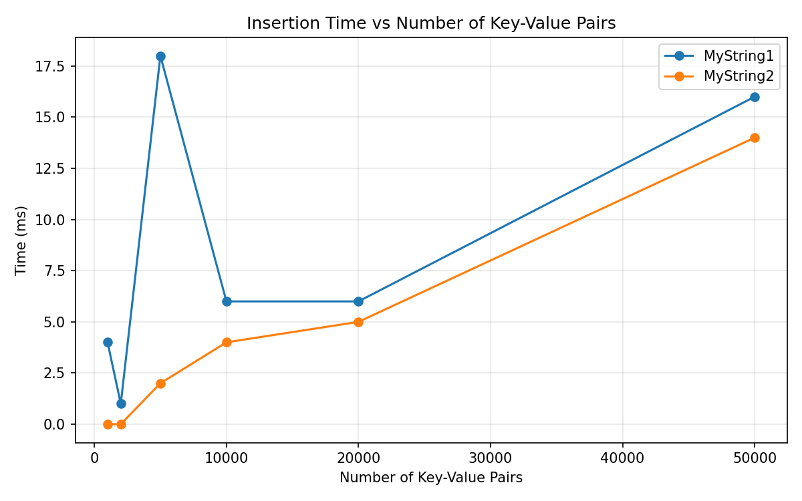
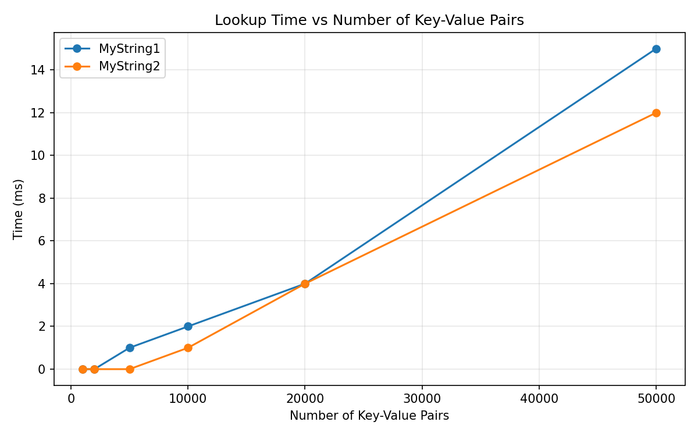

# 💙🤍REPORT04🤍💙

## 📘Table of Contents

1. [📘Table of Contents](#📘table-of-contents)
2. [🖖Info](#🖖info)
3. [🔗Links](#🔗links)

---

## 🖖Info

1. Make a graph where you plot the necessary time for all insertions against the number of key-value pairs. Make sure to plot the numbers for MyString1 and MyString2 on the same graph (Tip: You can use [Microsoft Excel](https://support.microsoft.com/en-us/office/present-your-data-in-a-scatter-chart-or-a-line-chart-4570a80f-599a-4d6b-a155-104a9018b86e), [MATLAB](https://www.mathworks.com/help/matlab/ref/plot.html) or [Matplotlib](https://matplotlib.org/stable/gallery/pyplots/pyplot_simple.html#sphx-glr-gallery-pyplots-pyplot-simple-py))
> 

2. Make another graph where you plot the necessary time for all look-ups against the number of key-value pairs. Make sure to plot the numbers for MyString1 and MyString2 on the same graph.
> 

3. Look at the graphs you made for the previous two questions, what do you notice? Can you explain this?
> Zie resultaten en uitleg hieronder. Samengevat: MyString2 is merkbaar sneller bij zowel insert als lookup in std::map omdat de comparator eerst een vooraf berekende 64‑bit hash vergelijkt, en enkel bij gelijke hash terugvalt op de volledige stringvergelijking. Daardoor zijn de meeste vergelijkingen O(1) i.p.v. karakter‑per‑karakter. Dit reduceert de constante factor in de O(log n) operaties van std::map.

## 🔗Links
- 👯 Web hosting company [EliasDH.com](https://eliasdh.com).
- 📫 How to reach us elias.dehondt@outlook.com